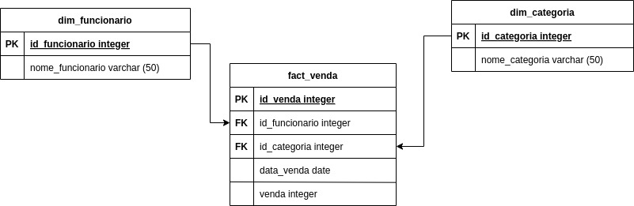
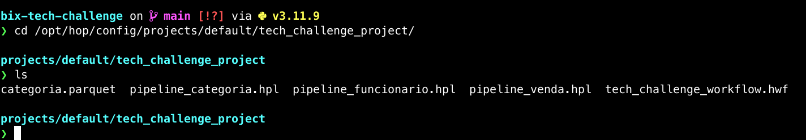
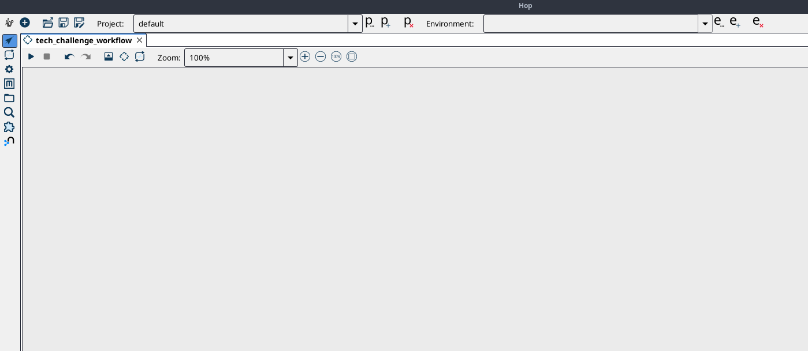
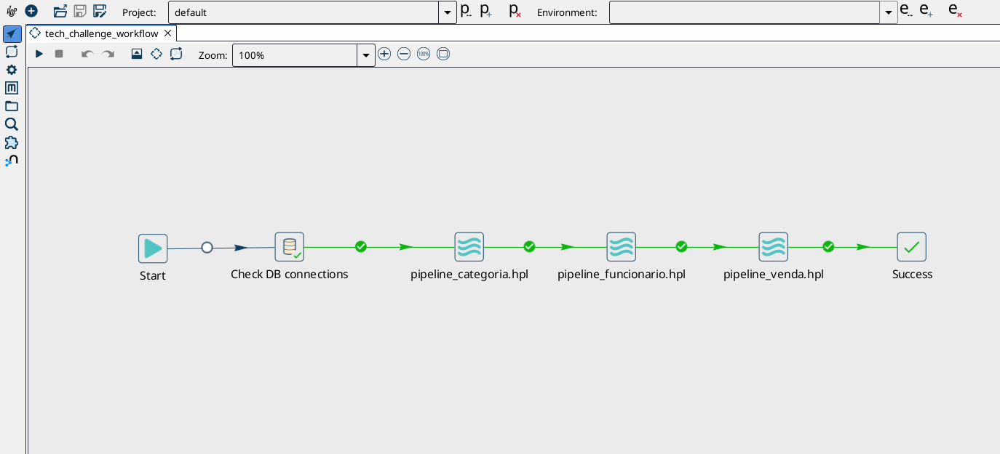
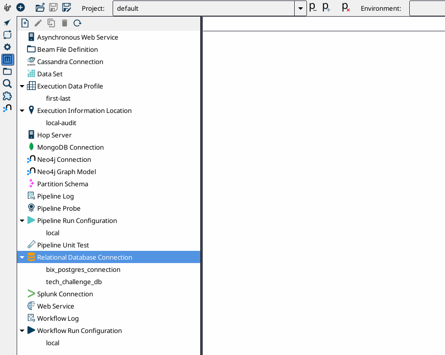
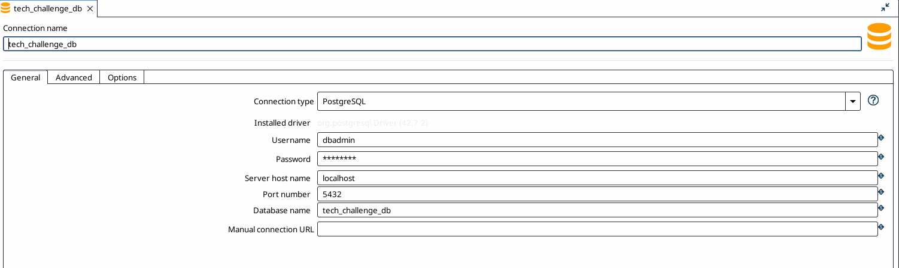
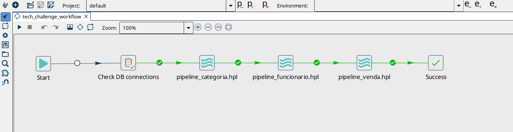

# bix-tech-challenge
Technical challenge for the position of junior data engineer at Bix Tecnologia

By João Paulo Macedo
profissional.jpmacedo@gmail.com

## Tech stack
- Apache Hop -> Pipeline development
- Jupyter notebook -> ETL development with Python
- PostgreSQL -> Local Data Warehouse implementation
- Docker -> Containerization and automatization of Postgres database creation

## Requirements
- Apache Hop
- Python 3.10 or superior
- Docker Engine and Docker Compose

## How to run
To set up a local Postgres database, run the following command inside the project's root directory:

`$ docker-compose up -d`

The init.sql file is referenced by docker-compose.yml and, once called, all the DW tables and relatioships will be created.

 
 
 
To start Apache Hop workflow, copy the files inside apache_hop folder into your Hop's project folder.

 
 
 
Once inside your hop root folder, execute `./hop-gui.sh` if using Linux or macOS or `hop-gui.bat` if using Windows and a white canvas will be displayed.

 
 
 
Press Ctrl+O or Command+O and select tech_challenge_worlflow.hwf inside your working directory.

 
 
 
Press Ctrl(or command)+Shift+M, right click on "Relational Database Connection" and "New" to configure databases connections "tech_challenge_db" and "bix_postgres_connection", respectively the local Postgres database and the external data source.

 
 
 
Finally, click on "Data Orchestration" and execute tech_challenge_worlflow.hwf by clicking on the triangle-shaped button.

 
 
## Future improvements
A better approach to work with large sets of data woulb be cloud implementation.
Google Storage or Amazon S3 are excellent tools to implement Data Lakes and Big Query or Amazon Redshift are also fantastic means to implement Data Warehouses.
